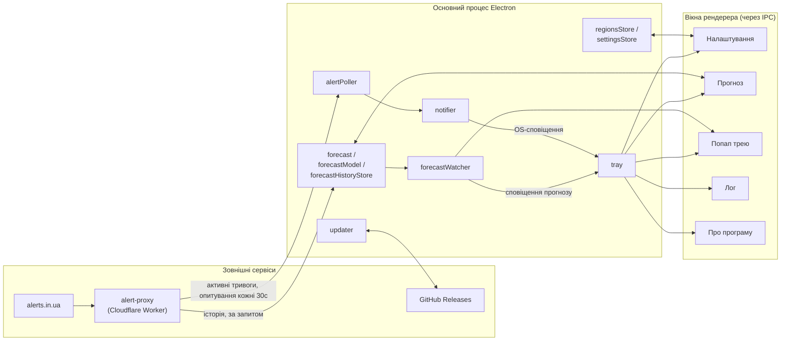

#  Alert Server

[EN](https://github.com/sergeiown/Alert_Server/blob/main/README.md) | **[UA](https://github.com/sergeiown/Alert_Server/blob/main/README-UA.md)**

> **Дисклеймер. Повномасштабна війна країни-агресора проти України триває, починаючи з лютого 2014 року та ескалації 24 лютого 2022 року. Вся територія України залишається зоною бойових дій та потенційної ракетної загрози. Зберігайте пильність, не ігноруйте сигнали повітряної тривоги та дотримуйтесь правил безпеки.**

Трей-застосунок для Windows на базі Electron, який з заданою періодичністю отримує дані про тривоги з [alerts.in.ua](https://alerts.in.ua/) і показує їх через Центр сповіщень Windows для обраних вами регіонів України.

## Архітектура

## Встановлення

Завантажте останній інсталятор (`Alert Server Setup x.x.x.exe`) зі сторінки [Releases](https://github.com/sergeiown/Alert_Server/releases) і запустіть його. Це стандартний NSIS-інсталятор: не потребує прав адміністратора, встановлення для одного користувача, ярлик у меню Пуск і деінсталятор створюються автоматично.

Подальші оновлення виявляються й встановлюються автоматично через GitHub Releases - інсталятор потрібно запускати вручну лише один раз.

## Використання

При першому запуску застосунок з'являється лише як іконка в треї, без вікна. Усе керування - через контекстне меню іконки трею:

- **Мапа тривог** / **Мапа фронту** відкривають [alerts.in.ua](https://alerts.in.ua/) і [DeepState](https://deepstatemap.live) у власному вікні застосунка.
- **Прогноз** відкриває вікно, де для кожного регіону моніторингу показано або позначку про активну тривогу, або статистику за останній місяць (кількість тривог, середній інтервал, найчастіший час і день тижня, час з моменту завершення останньої тривоги), а для кожного типу тривоги - ймовірність і орієнтовний час до наступної. Обидва числа тепер походять з однієї статистичної моделі, тож більше не суперечать одне одному: свіжі тривоги важать більше за давні, а типи з малою кількістю спостережень отримують обережну оцінку замість завищеної - і як і раніше, це явно позначено як статистику, а не гарантований прогноз. Кожен прогноз можна скопіювати в буфер обміну. Нижче списку - невеликий блок про те, скільки історії тривог накопичилось локально понад 30-денне вікно API (використовується для стабільніших оцінок рідкісних типів тривог), із кнопкою очищення за потреби. Найближчий прогноз по всіх регіонах моніторингу видно й без відкриття цього вікна - див. нижче.
- **Налаштування…** відкриває двоколонкове вікно: ліворуч - регіони моніторингу (дерево з пошуком, від області до окремої громади), праворуч - решта: мова інтерфейсу, монохромна іконка трею, візуальні сповіщення (з окремим тумблером для сповіщень про поточні тривоги), сповіщення про наближення прогнозованої тривоги і за скільки хвилин попереджати, режим звукового сповіщення (без звуку, сирена або голос) та кількість його повторень, а також автозапуск при старті Windows. Залежні пункти автоматично стають неактивними (наприклад, кількість повторень звуку, коли звук вимкнено). Автоматично підлаштовується під світлу/темну тему Windows.
- **Інформація → Лог** відкриває вбудований переглядач журналу у стилі термінала з кнопкою очищення; **Про програму** показує поточну версію, ліцензію і посилання на сторінку проєкту на GitHub.

Сповіщення про початок і завершення тривоги з'являються через Центр сповіщень Windows; клік на сповіщення показує локацію та час початку тривоги.

Клік лівою кнопкою по іконці трею відкриває невеликий попап з активними тривогами і, нижче, найближчим прогнозом для регіонів моніторингу - зручно, коли потрібен швидкий погляд без відкриття вікна прогнозу. Наведення курсора на іконку трею показує той самий найближчий прогноз у підказці, якщо активних тривог немає. Якщо увімкнено в Налаштуваннях (за замовчуванням увімкнено), застосунок також надсилає тихе сповіщення - без звуку - коли прогнозований час тривоги наближається, окремо від гучних сповіщень про тривогу/відбій вище.

Журнал подій фіксує активність застосунку (запуск/вихід, зміни налаштувань і регіонів, тривоги, перевірки оновлень) і обмежений 256 КБ, автоматично скорочується після досягнення цього розміру.

## Видалення

Використайте пункт `Alert Server` у Параметрах Windows → Додатки, або ярлик деінсталятора поруч із ярликом у меню Пуск.

## Внесок

Якщо у вас є пропозиції або бажання запропонувати покращення до проєкту, будь ласка, відкривайте Pull Request.

## Ліцензія

[Copyright (c) 2024-2026 Serhii I. Myshko](https://github.com/sergeiown/Alert_Server/blob/main/LICENSE) - Ліцензія MIT
