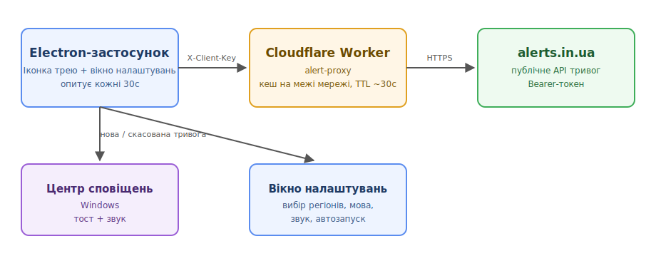
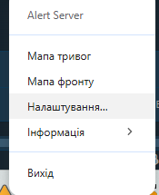
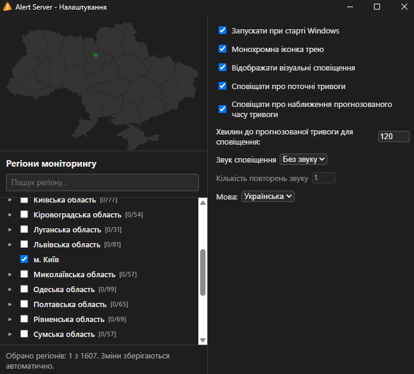
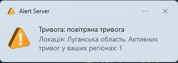

# Alert Server

[EN](https://github.com/sergeiown/Alert_Server/blob/main/README.md) | **[UA](https://github.com/sergeiown/Alert_Server/blob/main/README-UA.md)**

Трей-застосунок для Windows на базі Electron, який з заданою періодичністю отримує дані про тривоги з [alerts.in.ua](https://alerts.in.ua/) і показує їх через Центр сповіщень Windows для обраних вами регіонів України.

## Архітектура

## Встановлення

Завантажте останній інсталятор (`Alert Server Setup x.x.x.exe`) зі сторінки [Releases](https://github.com/sergeiown/Alert_Server/releases) і запустіть його. Це стандартний NSIS-інсталятор: не потребує прав адміністратора, встановлення для одного користувача, ярлик у меню Пуск і деінсталятор створюються автоматично.

Подальші оновлення виявляються й встановлюються автоматично через GitHub Releases - інсталятор потрібно запускати вручну лише один раз.

## Використання

При першому запуску застосунок з'являється лише як іконка в треї, без вікна. Усе керування - через контекстне меню іконки трею:

- **Мапа тривог** / **Мапа фронту** відкривають [alerts.in.ua](https://alerts.in.ua/) і [DeepState](https://deepstatemap.live) у власному вікні застосунка.
- **Прогноз** відкриває вікно, де для кожного регіону моніторингу показано або позначку про активну тривогу, або статистику за останній місяць (кількість тривог, середній інтервал, найчастіший час і тип тривоги, час з моменту завершення останньої тривоги, орієнтовна оцінка на основі тенденції) - явно позначено як статистику, а не гарантований прогноз. Кожен прогноз можна скопіювати в буфер обміну.
- **Налаштування…** відкриває вікно налаштувань, де можна обрати регіони моніторингу (дерево з пошуком, від області до окремої громади), мову інтерфейсу, монохромну іконку трею, режим звукового сповіщення (без звуку, сирена або голос) та кількість його повторень, а також автозапуск при старті Windows. Автоматично підлаштовується під світлу/темну тему Windows.
- **Інформація → Лог** відкриває журнал подій; **Про програму** показує поточну версію та ліцензію.

Сповіщення про початок і завершення тривоги з'являються через Центр сповіщень Windows; клік на сповіщення показує локацію та час початку тривоги.

Журнал подій фіксує активність застосунку (запуск/вихід, зміни налаштувань і регіонів, тривоги, перевірки оновлень) і обмежений 256 КБ, автоматично скорочується після досягнення цього розміру.

## Видалення

Використайте пункт `Alert Server` у Параметрах Windows → Додатки, або ярлик деінсталятора поруч із ярликом у меню Пуск.

## Внесок

Якщо у вас є пропозиції або бажання запропонувати покращення до проєкту, будь ласка, відкривайте Pull Request.

## Ліцензія

[Copyright (c) 2024-2026 Serhii I. Myshko](https://github.com/sergeiown/Alert_Server/blob/main/LICENSE) - Ліцензія MIT
