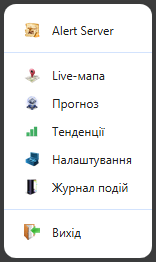
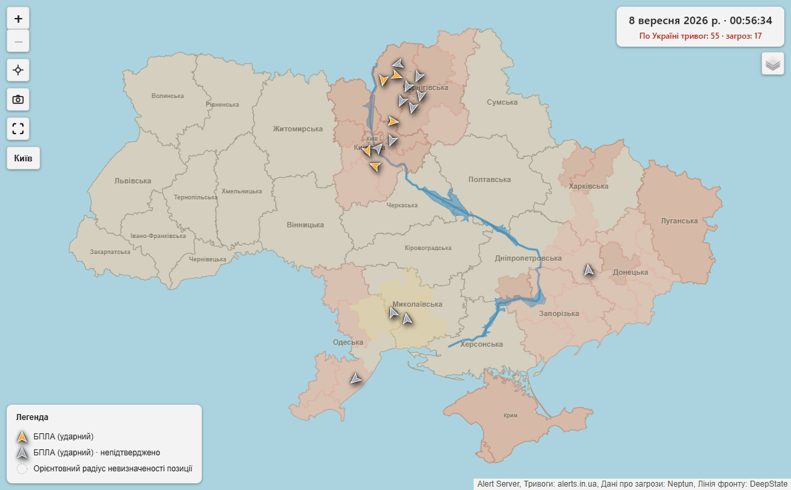
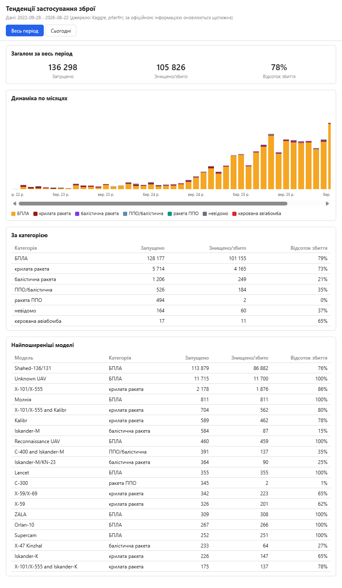
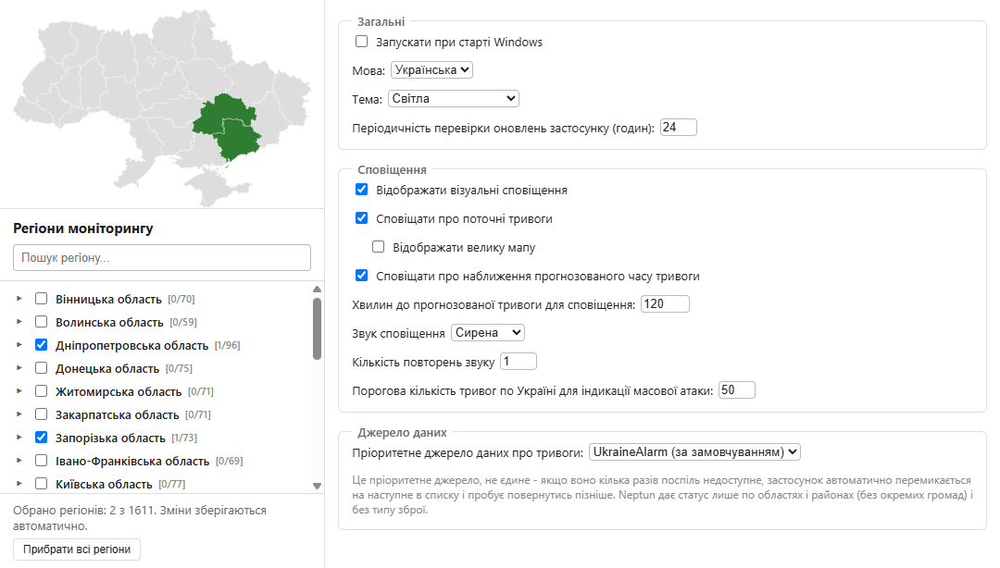
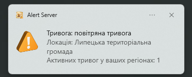
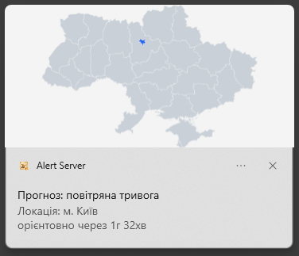

#  Alert Server

> **Дисклеймер. Повномасштабна війна країни-агресора проти України триває, починаючи з лютого 2014 року та ескалації 24 лютого 2022 року. Вся територія України залишається зоною бойових дій та потенційної ракетної загрози. Зберігайте пильність, не ігноруйте сигнали повітряної тривоги та дотримуйтесь правил безпеки.**

Трей-застосунок для Windows на базі Electron, який з заданою періодичністю отримує дані про тривоги з [UkraineAlarm](https://api.ukrainealarm.com/) (з автоматичним переходом на [alerts.in.ua](https://alerts.in.ua/) і [Neptun](https://neptun.in.ua), якщо воно перестає відповідати), показує їх через Центр сповіщень Windows для обраних вами регіонів України, а також об'єднує в одному місці живу мапу загроз, статистичний прогноз та загальнонаціональну статистику застосування зброї.

## Архітектура

## Встановлення

Завантажте останній інсталятор (`Alert Server Setup x.x.x.exe`) зі сторінки [Releases](https://github.com/sergeiown/Alert_Server/releases) і запустіть його. Це стандартний NSIS-інсталятор: не потребує прав адміністратора, встановлення для одного користувача, ярлик у меню Пуск і деінсталятор створюються автоматично.

Подальші оновлення виявляються й встановлюються автоматично через GitHub Releases - інсталятор потрібно запускати вручну лише один раз. Застосунок перевіряє оновлення невдовзі після кожного запуску, а потім і надалі періодично (періодичність налаштовується, за замовчуванням - раз на добу) протягом усього часу роботи - тож трей-застосунок, залишений відкритим тижнями, все одно отримає оновлення без потреби вручну його перезапускати. Невелике вікно показує прогрес завантаження, а після завантаження застосунок сам перезапускається для завершення встановлення - без перезавантаження системи.

## Використання

При першому запуску застосунок з'являється лише як іконка в треї, без вікна. Сама іконка автоматично підлаштовується під світлу/темну тему трею Windows і під реальний розмір іконки при поточному масштабуванні екрана. Вона показує знак оклику й похитується з червоним кольоровим пульсом протягом усієї активної тривоги, коротко пульсує при кожному оновленні даних, якщо тривоги немає, і стає повністю червоною, коли кількість активних тривог по всій Україні перевищує заданий вами порог (індикатор масової атаки, незалежний від ваших регіонів моніторингу). Усе керування - через контекстне меню іконки трею:

<picture>
  <source media="(prefers-color-scheme: dark)" srcset="docs/images/tray-menu-uk-dark.png">
  
</picture>

- **Live-мапа** відкриває власне вікно мапи застосунку: загрози в реальному часі з [Neptun](https://neptun.in.ua) (дрони, ракети, керовані авіабомби, літаки-носії ракет - кожен зі своєю іконкою, тінню і, де відомо, напрямком руху, автоматично трохи розсунуті, якщо кілька опиняються поруч, щоб жоден не сховався за іншим; усе, що сам Neptun ще не підтвердив, показано сірим кольором, з ледь помітним колом навколо - орієнтовним радіусом невизначеності позиції, обидва пояснені в адаптивній легенді, яка показує лише те, що справді є на мапі), лінію фронту з [DeepState](https://deepstatemap.live), окуповані території (заштриховані), а також усі області/райони/міста, що зараз під тривогою, підсвічені червоним, який стає темнішим, чим довше триває тривога. Шари перемикаються незалежно, є повноекранний режим, кнопка скріншота копіює всю мапу в буфер обміну, а рядок стану показує поточну дату/час і кількість активних тривог та загроз на мапі.

  <picture>
    <source media="(prefers-color-scheme: dark)" srcset="docs/images/live-map-uk-dark.png">
    
  </picture>

- **Прогноз** відкриває вікно, де для кожного регіону моніторингу показано або позначку про активну тривогу, або статистика (кількість тривог, середній інтервал, найчастіший час і день тижня, час з моменту завершення останньої тривоги), а для кожного типу тривоги - ймовірність і орієнтовний час до наступної - у верхньому рядку зазначено, яке саме з двох джерел востаннє наповнило дані для цього регіону. Детальний опис методології - у [описі моделі прогнозування](docs/forecast-methodology-uk.md): як рахується оцінка, що означають числа, які відомі обмеження підходу - і, як і раніше, це явно позначено як статистику, а не гарантований прогноз. Картки сортуються за тим, наскільки скоро очікується тривога, активні регіони - завжди зверху; якщо відстежується і ціла область, і один з її районів, у списку показується лише область (вона й так агрегує всю статистику). Кожен прогноз можна скопіювати в буфер обміну. Нижче списку - невеликий блок про те, скільки історії тривог накопичилось локально (обмежено приблизно 2 роками, з кнопкою очищення за потреби - одноразовий бекфіл при першому запуску одразу дає реальний місяць даних, замість накопичення з нуля), а також примітка про історичний датасет, яким відкалібровано довгостроковий базовий рівень моделі.
- **Тенденції** відкриває вікно із двома вкладками. **За весь період** - загальнонаціональна статистика застосування зброї, зібрана з публічного датасету (див. [Джерела даних та атрибуції](#джерела-даних-та-атрибуції)): підсумки й відсоток збиття, графік по місяцях у розрізі категорій зброї, таблиці за категорією та за конкретною моделлю. **Сьогодні** - кількість тривог по Україні з опівночі, графік по годинах доби, розбивка по областях і окремо по ваших регіонах моніторингу - побудовано з загальнонаціонального фіда, який безперервно оновлюється у фоні (із зазначенням, яке з двох джерел його наповнило), тож дані вірні навіть одразу після першого за день відкриття застосунку, з невеликою приміткою, якщо збір ще триває.

  <picture>
    <source media="(prefers-color-scheme: dark)" srcset="docs/images/trends-uk-dark.png">
    
  </picture>

- **Налаштування** відкриває двоколонкове вікно: ліворуч - регіони моніторингу (клікабельна мапа областей України над деревом із пошуком, від області до окремої громади - вибір регіону на мапі чи в дереві синхронізується; позначення регіону вищого рівня вибирає й усі вкладені в нього регіони; кнопка дозволяє одразу зняти весь вибір), праворуч - решта, згрупована в три розділи: **Загальні** (мова інтерфейсу, тема - світла/темна/авто, автозапуск при старті Windows, періодичність перевірки оновлень застосунку), **Сповіщення** (окремі тумблери для сповіщень про поточні тривоги й про наближення прогнозованої тривоги з тим, за скільки хвилин попереджати, порогова кількість тривог по Україні для індикатора масової атаки в треї, режим звукового сповіщення - без звуку, сирена або голос - та кількість його повторень) і **Джерело даних** (звідки беруться самі дані про поточні тривоги, на яких побудовано все інше в застосунку - [UkraineAlarm](https://api.ukrainealarm.com/) за замовчуванням, з живими push-оновленнями через підписаний webhook на додаток до опитування, з автоматичним переходом на [alerts.in.ua](https://alerts.in.ua/), а потім на власний безтокенний ендпоінт [Neptun](https://neptun.in.ua), якщо пріоритетне джерело перестає відповідати, з фоновою спробою повернутись на нього, щойно воно відновиться - це пріоритет, а не єдиний варіант; ручне перемикання й далі перезапускає застосунок). Залежні пункти автоматично стають неактивними (наприклад, кількість повторень звуку, коли звук вимкнено).

  <picture>
    <source media="(prefers-color-scheme: dark)" srcset="docs/images/settings-window-uk-dark.png">
    
  </picture>

- **Журнал подій** відкриває вбудований переглядач журналу у стилі термінала з кнопками очищення та відкриття файлу журналу в Блокноті.

Клік по пункту **Alert Server** зверху меню відкриває вікно "Про програму" з поточною версією, ліцензією і посиланням на сторінку проєкту на GitHub.

Сповіщення про початок і завершення тривоги з'являються через Центр сповіщень Windows з невеликою мапою, де підсвічено відповідний регіон (червоний - нова тривога, зелений - відбій); клік на сповіщення показує локацію та час початку тривоги. Якщо одночасно починається або завершується понад 5 тривог, замість потоку окремих сповіщень показується одне - із загальною кількістю і всіма зачепленими регіонами на мапі.

<picture>
  <source media="(prefers-color-scheme: dark)" srcset="docs/images/alert-uk-dark.png">
  
</picture>

Клік лівою кнопкою по іконці трею відкриває невеликий попап з активними тривогами і, нижче, найближчим прогнозом для регіонів моніторингу - зручно, коли потрібен швидкий погляд без відкриття вікна прогнозу. Наведення курсора на іконку трею показує той самий найближчий прогноз у підказці, якщо активних тривог немає. Якщо увімкнено в Налаштуваннях (за замовчуванням увімкнено), застосунок також надсилає сповіщення - із синьою мапою регіону, без звуку тривоги - коли прогнозований час тривоги наближається, окремо від сповіщень про тривогу/відбій вище; за одну перевірку спрацьовує не більше 3, найближчі першими, щоб не заспамити, якщо одночасно підходять кілька регіонів.

<picture>
  <source media="(prefers-color-scheme: dark)" srcset="docs/images/forecast-notify-uk-dark.png">
  
</picture>

Журнал подій фіксує активність застосунку (запуск/вихід, зміни налаштувань і регіонів, тривоги, перевірки оновлень) у форматі CSV, кожен рядок позначений рівнем (інформація, попередження, помилка, мережа або власне тривога, що почалась чи скінчилась) - тож побіжного погляду достатньо, щоб зрозуміти, що важливе, не читаючи все підряд. Пишеться завжди англійською незалежно від мови інтерфейсу - журнал призначений для читання пізніше, а не для перекладу на льоту, і відкривається одразу як нормальна таблиця при подвійному кліку в Excel, а не одним нечитабельним рядком. Обмежений 1 МБ, автоматично скорочується після досягнення цього розміру.

## Джерела даних та атрибуції

Окрім самих джерел тривог - [UkraineAlarm](https://api.ukrainealarm.com/) (основне, з push-оновленнями через підписаний webhook на додаток до опитування) і [alerts.in.ua](https://alerts.in.ua/) (його автоматичний резерв) - обидва використовуються напряму, атрибуція не вимагається умовами жодного з них:

- **[Neptun](https://neptun.in.ua)** - трекінг загроз у реальному часі (дрони, ракети) на Live-мапі, завжди, а також, за бажанням (див. Налаштування вище), додатковий резерв для самих даних про поточні тривоги, якщо обидва джерела вище перестають відповідати. Використовується напряму; атрибуція не вимагається умовами використання, але вказана в застосунку і тут як ввічливість.
- **[DeepState](https://deepstatemap.live/)** - лінія фронту на Live-мапі, дзеркалиться щодня через [cyterat/deepstate-map-data](https://github.com/cyterat/deepstate-map-data) (GPL-3.0). Споживається як живий потік даних під час роботи, а не як вбудований код.
- **[Natural Earth](https://www.naturalearthdata.com/)** (через дзеркало [nvkelso/natural-earth-vector](https://github.com/nvkelso/natural-earth-vector)) - контур річки Дніпро на Live-мапі. Суспільне надбання (public domain), атрибуція не вимагається.
- **[slawomirmatuszak/ukrainian_geodata](https://github.com/slawomirmatuszak/ukrainian_geodata)** - межі областей, районів і міст/громад по всій Live-мапі. **Ліцензія [CC BY 4.0](https://creativecommons.org/licenses/by/4.0/) - атрибуція обов'язкова**, наведена тут.
- **[MapSVG](https://mapsvg.com/maps/ukraine)** - базовий контур України для мапи вибору регіонів і мініатюр у сповіщеннях. Вільне використання, включно з комерційним, атрибуція не вимагається умовами джерела.
- **[Vadimkin/ukrainian-air-raid-sirens-dataset](https://github.com/Vadimkin/ukrainian-air-raid-sirens-dataset)** (MIT) - кілька років реальної загальнонаціональної історії сирен, використано одноразово, офлайн, для калібрування довгострокового базового рівня моделі прогнозу (див. [методологію прогнозування](docs/forecast-methodology-uk.md)). Не входить до застосунку і не завантажується під час роботи.
- **["Massive Missile Attacks on Ukraine"](https://www.kaggle.com/datasets/piterfm/massive-missile-attacks-on-ukraine) від Petro Ivaniuk (piterfm), через Kaggle** - дані для вікна "Тенденції", автоматично оновлюються через власний проксі застосунку (облікові дані Kaggle ніколи не залишають цей проксі). **Ліцензія [CC BY-NC-SA 4.0](https://creativecommons.org/licenses/by-nc-sa/4.0/)**: обов'язкова атрибуція, **лише некомерційне використання**, і поширення на тих самих умовах (вікно "Тенденції" технічно є похідним поданням цих даних). Цей застосунок безкоштовний і некомерційний, що задовольняє умову NC, але це реальне обмеження, про яке варто знати. Також варто зазначити: станом на момент написання, першоджерело датасету (публічні звіти Повітряних сил ЗСУ) припинило публікувати нові цифри з 10 серпня 2026 року, тож автоматичне оновлення може не показувати нових даних понад цю дату, доки (і якщо) це не зміниться.
- **[Leaflet](https://leafletjs.com/)** (BSD-2-Clause) - основа Live-мапи, разом із [кнопкою повноекранного режиму](https://github.com/sergeiown/Leaflet_FullScreen_Button) - моїм давнішим проєктом плагіна саме для Leaflet, який чудово прийшовся тут до нагоди.

## Видалення

Використайте пункт `Alert Server` у Параметрах Windows → Додатки, або ярлик деінсталятора поруч із ярликом у меню Пуск.

## Внесок

Якщо у вас є пропозиції або бажання запропонувати покращення до проєкту, будь ласка, відкривайте Pull Request.

## Ліцензія

[Copyright (c) 2024-2026 Serhii I. Myshko](https://github.com/sergeiown/Alert_Server/blob/main/LICENSE) - Ліцензія MIT
