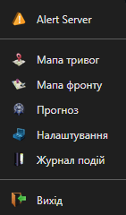
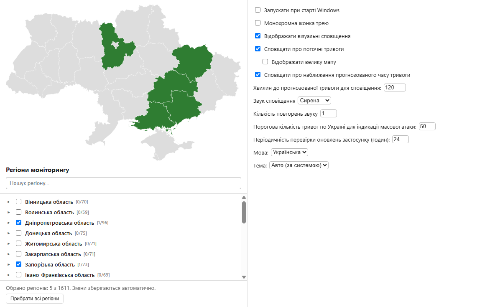
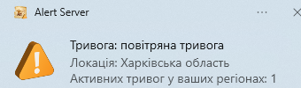

#  Alert Server

> **Дисклеймер. Повномасштабна війна країни-агресора проти України триває, починаючи з лютого 2014 року та ескалації 24 лютого 2022 року. Вся територія України залишається зоною бойових дій та потенційної ракетної загрози. Зберігайте пильність, не ігноруйте сигнали повітряної тривоги та дотримуйтесь правил безпеки.**

Трей-застосунок для Windows на базі Electron, який з заданою періодичністю отримує дані про тривоги з [alerts.in.ua](https://alerts.in.ua/) і показує їх через Центр сповіщень Windows для обраних вами регіонів України.

## Архітектура

## Встановлення

Завантажте останній інсталятор (`Alert Server Setup x.x.x.exe`) зі сторінки [Releases](https://github.com/sergeiown/Alert_Server/releases) і запустіть його. Це стандартний NSIS-інсталятор: не потребує прав адміністратора, встановлення для одного користувача, ярлик у меню Пуск і деінсталятор створюються автоматично.

Подальші оновлення виявляються й встановлюються автоматично через GitHub Releases - інсталятор потрібно запускати вручну лише один раз. Прогрес завантаження показується в підказці іконки трею, а сповіщення підтверджує, коли оновлення готове до встановлення.

## Використання

При першому запуску застосунок з'являється лише як іконка в треї, без вікна. Сама іконка (кольорова чи монохромна - залежно від Налаштувань) автоматично підлаштовується під світлу/темну тему трею Windows і під реальний розмір іконки при поточному масштабуванні екрана, а також показує знак оклику під час активної тривоги. Вона коротко пульсує при кожному оновленні даних, якщо тривоги немає, і похитується з червоним кольоровим пульсом протягом усієї активної тривоги. Усе керування - через контекстне меню іконки трею:

- **Мапа тривог** / **Мапа фронту** відкривають [alerts.in.ua](https://alerts.in.ua/) і [DeepState](https://deepstatemap.live) у власному вікні застосунка.
- **Прогноз** відкриває вікно, де для кожного регіону моніторингу показано або позначку про активну тривогу, або статистику за останній місяць (кількість тривог, середній інтервал, найчастіший час і день тижня, час з моменту завершення останньої тривоги), а для кожного типу тривоги - ймовірність і орієнтовний час до наступної. Детальний опис методології - у [описі моделі прогнозування](docs/forecast-methodology-uk.md): як рахується оцінка, що означають числа, які відомі обмеження підходу - і, як і раніше, це явно позначено як статистику, а не гарантований прогноз. Картки сортуються за тим, наскільки скоро очікується тривога, активні регіони - завжди зверху; якщо відстежується і ціла область, і один з її районів, у списку показується лише область (вона й так агрегує всю статистику). Кожен прогноз можна скопіювати в буфер обміну. Нижче списку - невеликий блок про те, скільки історії тривог накопичилось локально понад 30-денне вікно API, із кнопкою очищення за потреби.
- **Налаштування** відкриває двоколонкове вікно: ліворуч - регіони моніторингу (дерево з пошуком, від області до окремої громади - позначення регіону вищого рівня вибирає й усі вкладені в нього регіони, а кнопка дозволяє одразу зняти весь вибір), праворуч - решта: мова інтерфейсу, монохромна іконка трею, візуальні сповіщення (з окремим тумблером для сповіщень про поточні тривоги), сповіщення про наближення прогнозованої тривоги і за скільки хвилин попереджати, режим звукового сповіщення (без звуку, сирена або голос) та кількість його повторень, а також автозапуск при старті Windows. Залежні пункти автоматично стають неактивними (наприклад, кількість повторень звуку, коли звук вимкнено). Автоматично підлаштовується під світлу/темну тему Windows.
- **Журнал подій** відкриває вбудований переглядач журналу у стилі термінала з кнопками очищення та відкриття файлу журналу в Блокноті.

Клік по пункту **Alert Server** зверху меню відкриває вікно "Про програму" з поточною версією, ліцензією і посиланням на сторінку проєкту на GitHub.

Сповіщення про початок і завершення тривоги з'являються через Центр сповіщень Windows з невеликою мапою, де підсвічено відповідний регіон (червоний - нова тривога, зелений - відбій); клік на сповіщення показує локацію та час початку тривоги. Якщо одночасно починається або завершується понад 5 тривог, замість потоку окремих сповіщень показується одне - із загальною кількістю і всіма зачепленими регіонами на мапі.

Клік лівою кнопкою по іконці трею відкриває невеликий попап з активними тривогами і, нижче, найближчим прогнозом для регіонів моніторингу - зручно, коли потрібен швидкий погляд без відкриття вікна прогнозу. Наведення курсора на іконку трею показує той самий найближчий прогноз у підказці, якщо активних тривог немає. Якщо увімкнено в Налаштуваннях (за замовчуванням увімкнено), застосунок також надсилає сповіщення - із синьою мапою регіону, без звуку тривоги - коли прогнозований час тривоги наближається, окремо від сповіщень про тривогу/відбій вище; за одну перевірку спрацьовує не більше 3, найближчі першими, щоб не заспамити, якщо одночасно підходять кілька регіонів.

Журнал подій фіксує активність застосунку (запуск/вихід, зміни налаштувань і регіонів, тривоги, перевірки оновлень) у форматі CSV і обмежений 256 КБ, автоматично скорочується після досягнення цього розміру.

## Видалення

Використайте пункт `Alert Server` у Параметрах Windows → Додатки, або ярлик деінсталятора поруч із ярликом у меню Пуск.

## Внесок

Якщо у вас є пропозиції або бажання запропонувати покращення до проєкту, будь ласка, відкривайте Pull Request.

## Ліцензія

[Copyright (c) 2024-2026 Serhii I. Myshko](https://github.com/sergeiown/Alert_Server/blob/main/LICENSE) - Ліцензія MIT
