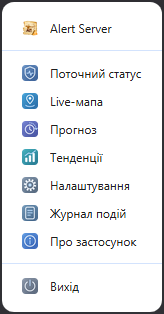
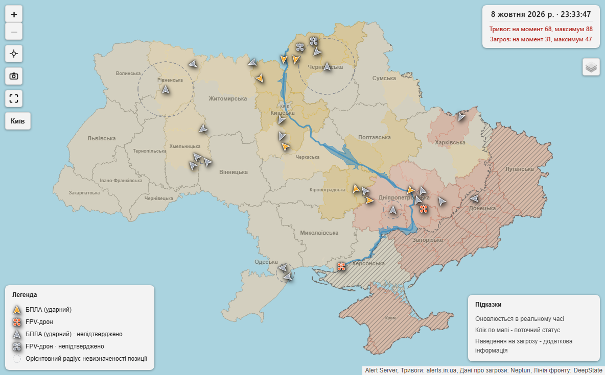
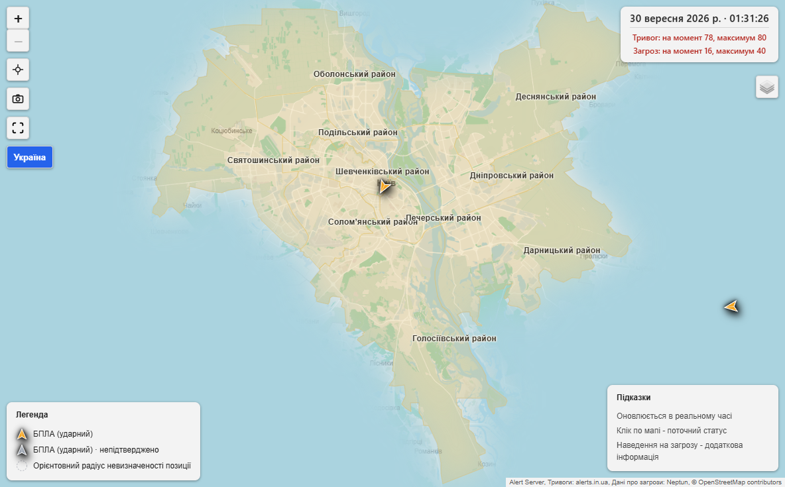
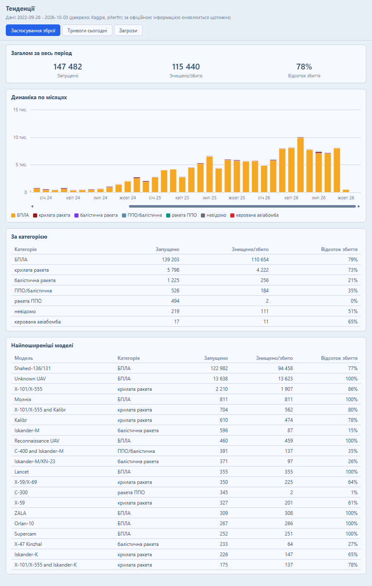
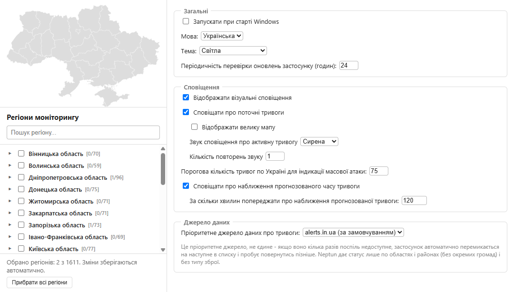
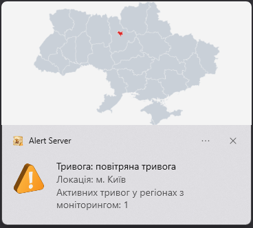
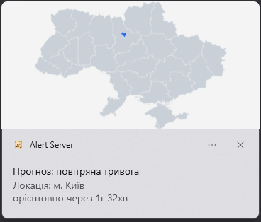

#  Alert Server

> **Дисклеймер. Повномасштабна війна країни-агресора проти України триває, починаючи з лютого 2014 року та ескалації 24 лютого 2022 року. Вся територія України залишається зоною бойових дій та потенційної ракетної загрози. Зберігайте пильність, не ігноруйте сигнали повітряної тривоги та дотримуйтесь правил безпеки.**

Трей-застосунок для Windows на базі Electron, який стежить за повітряними тривогами по Україні замість вас: отримує дані з [alerts.in.ua](https://alerts.in.ua/) (з автоматичним переходом на [Neptun](https://neptun.in.ua), а також на [UkraineAlarm](https://api.ukrainealarm.com/), коли це джерело увімкнене на сервері, якщо основне замовкає), доставляє їх просто в Центр сповіщень Windows для обраних вами регіонів, і об'єднує в одному місці живу мапу загроз (є й [у браузері](https://alert-proxy-ua.duckdns.org/live/)), статистичний прогноз та загальну статистику застосування зброї.

## Архітектура

## Як це працює

Застосунок сам не звертається до API тривог. Він працює з невеликою власною серверною частиною (Node.js на безкоштовній хмарній VM), яка робить основну роботу один раз для всіх:

- **Один опитувач замість одного на кожного користувача.** Сервер опитує alerts.in.ua з максимальною частотою, яку дозволяє його API, і розсилає кожну зміну всім підключеним застосункам через WebSocket, тож тривога доходить до вас у ту саму мить, коли її побачив сервер, а зовнішнє API навіть не помічає, скільки людей користується застосунком. Живий потік загроз Neptun ретранслюється так само, з автоматичним прямим підключенням як запасним варіантом, якщо сервер колись недоступний.
- **Спільний архів.** Кожна тривога і загроза, яку бачить сервер, зберігається в його власній базі даних (із щоденними резервними копіями), тож історія більше не живе на кожному комп'ютері окремо.
- **Прогноз і статистика на сервері.** Прогноз, статистика дня, піки за добу, шар окупованої території та датасет застосування зброї обчислюються або кешуються там, а застосунок лише запитує готові числа. Саме тому свіжа інсталяція одразу має повну історію і прогноз з першої хвилини, і саме тому нічого не треба накопичувати чи очищати локально.
- **Приватність.** Унікальні пристрої рахуються за хешем IP-адреси, зберігається лише код країни; самі адреси не зберігаються.

## Вебмапа

Немає під рукою Windows? Та сама жива мапа працює в будь-якому браузері, і на телефоні теж: **[alert-proxy-ua.duckdns.org/live](https://alert-proxy-ua.duckdns.org/live/)**. Це Live-мапа застосунку, яку віддає власний сервер проєкту: нічого встановлювати й ніякого акаунта.

- Тривоги по областях, районах і районах Києва в реальному часі, а також добові піки та наближений вид Києва.
- Чудово працює в режимі застосунку на iOS, iPadOS та Android: відкрийте в браузері й додайте на головний екран ("Поділитися" > "На екран Додому" у Safari, "Установити застосунок" у Chrome). Далі вона запускається на весь екран зі своєю іконкою, як звичайний застосунок, і не потребує жодного магазину застосунків.
- Інтерфейс українською й англійською, тема світла/темна/авто. Ваш вибір зберігається лише у вашому браузері.
- Без cookies і трекерів. Сервер веде лише анонімні добові лічильники (відвідувачі, країна, мова), IP-адреси не зберігаються.
- Це неофіційне джерело: дані можуть запізнюватися або бути неповними, тож завжди дотримуйтесь офіційних сигналів тривоги.

Її код лежить у [web-map/](web-map/) і використовує код мапи з десктопного застосунку.

## Встановлення

Завантажте останній інсталятор (`Alert Server Setup x.x.x.exe`) зі сторінки [Releases](https://github.com/sergeiown/Alert_Server/releases) і запустіть його. Це стандартний NSIS-інсталятор: не потребує прав адміністратора, встановлення для одного користувача, ярлик у меню Пуск і деінсталятор створюються автоматично.

Подальші оновлення виявляються й встановлюються автоматично через GitHub Releases - інсталятор потрібно запускати вручну лише один раз. Застосунок перевіряє оновлення невдовзі після кожного запуску, а потім і надалі періодично (періодичність налаштовується, за замовчуванням - раз на добу) протягом усього часу роботи - тож трей-застосунок, залишений відкритим тижнями, все одно отримає оновлення без потреби вручну його перезапускати. Невелике вікно показує прогрес завантаження, а після завантаження застосунок сам перезапускається для завершення встановлення - без перезавантаження системи.

## Використання

При першому запуску застосунок з'являється лише як іконка в треї, без вікна. Сама іконка автоматично підлаштовується під світлу/темну тему трею Windows і під реальний розмір іконки при поточному масштабуванні екрана. Вона показує знак оклику й похитується з червоним кольоровим пульсом протягом усієї активної тривоги, коротко пульсує при кожному оновленні даних, якщо тривоги немає, і стає повністю червоною, коли кількість активних тривог по всій Україні перевищує заданий вами порог (індикатор масової атаки, незалежний від ваших регіонів моніторингу). Усе керування - через контекстне меню іконки трею:

<picture>
  <source media="(prefers-color-scheme: dark)" srcset="docs/images/tray-menu-uk-dark.png">
  
</picture>

- **Live-мапа** відкриває власне вікно мапи застосунку: загрози в реальному часі з [Neptun](https://neptun.in.ua) (дрони, ракети, керовані авіабомби, літаки-носії ракет - кожен зі своєю іконкою, тінню і, де відомо, напрямком руху, автоматично трохи розсунуті, якщо кілька опиняються поруч, щоб жоден не сховався за іншим; усе, що сам Neptun ще не підтвердив, показано сірим кольором, з ледь помітним колом навколо - орієнтовним радіусом невизначеності позиції, обидва пояснені в адаптивній легенді, яка показує лише те, що справді є на мапі), лінію фронту з [DeepState](https://deepstatemap.live), окуповані території (заштриховані), а також усі області/райони/міста, що зараз під тривогою, підсвічені червоним або жовтим (відповідно до офіційного рівня загрози, який тепер повідомляють усі три живих джерела - червоний зазвичай ракетна загроза, жовтий - дронова), у відтінку, який стає темнішим, чим довше триває тривога, і пульсує кількома "ударами" щоразу, коли статус регіону справді змінюється, щоб нову чи скасовану тривогу було важко не помітити; у спливаючій підказці регіону вказано конкретну загрозу, якщо вона відома. Сам потік Neptun відстежується у фоні безперервно, поки застосунок запущений, а не лише поки відкрите це вікно, тож іконки загроз оновлюються одразу при відкритті мапи, а не чекають на нове з'єднання. Нова загроза "падає" на мапу зверху й осідає до звичайного розміру, скасована зникає невеликим вибухом з розльотом уламків, а існуюча плавно перелітає в нову позицію замість миттєвого стрибка - і кожна анімація має трохи свою тривалість, щоб кілька іконок одразу не рухались абсолютно синхронно. Шари перемикаються незалежно, є повноекранний режим, кнопка скріншота копіює всю мапу в буфер обміну, а рядок стану показує поточну дату/час і кількість активних тривог та загроз на мапі.

  <picture>
    <source media="(prefers-color-scheme: dark)" srcset="docs/images/live-map-uk-dark.png">
    
  </picture>

  Кнопка **Київ** перемикає те саме вікно на детальний вигляд столиці: детальна мапа вулиць із підписами районів зверху замість плаского абстрактного контуру загальної мапи, кожен з десяти районів Києва зафарбований відповідно до власного рівня тривоги - діагональна червоно-жовта штриховка, якщо в районі справді активні обидва рівні одночасно, що є реальною особливістю того, як саме звітують про тривоги в Києві (на відміну від будь-якого іншого відстежуваного міста - розбивку по районах, а не єдиний статус на все місто), кожен зі спливаючою підказкою, яка називає конкретну загрозу. Іконки загроз тут трохи більші, ніж на загальній мапі, оскільки лежать на детальній мапі вулиць, а не на плоскому контурі (легенда при цьому однакового розміру в обох режимах). Поки режим активний, кнопка стає **Україна**; кнопка центрування й будь-яка зміна розміру чи повноекранний режим і надалі підлаштовуються саме під Київ, а масштаб можна лише збільшувати від цього положення, не зменшувати за його межі.

  <picture>
    <source media="(prefers-color-scheme: dark)" srcset="docs/images/live-map-kyiv-uk-dark.png">
    
  </picture>

  Якщо сам Київ обраний для відстеження, його райони отримують такі самі сповіщення, як і будь-який інший регіон моніторингу - по одному на щойно зачеплений район, або одне зведене, якщо одночасно починається чи завершується три й більше - а якщо ввімкнено відкриття live-мапи при тривозі, вона одразу відкривається саме в цьому вигляді Києва, а не в загальноукраїнському.

- **Прогноз** відкриває вікно, де для кожного регіону моніторингу показано або - якщо в регіоні зараз активна тривога - скільки вона вже триває плюс середню тривалість цього типу тривоги (за останню добу і за весь період спостережень; прогноз ймовірності/часу нижче на цей момент не діє, про що прямо й написано), або, коли активних тривог немає, статистика (кількість тривог, середній інтервал, найчастіший час і день тижня, час з моменту завершення останньої тривоги), а для кожного типу тривоги - ймовірність (протягом найближчих кількох годин, свідомо не "сьогодні" - за повну добу число стрімко впирається в беззмістовне "приблизно 100%" для будь-якого регіону з інтенсивністю вище кількох тривог на добу, а це зараз типово), очікувана кількість тривог за добу, і орієнтовний час до наступної - у верхньому рядку зазначено джерело даних. Детальний опис методології - у [описі моделі прогнозування](docs/forecast-methodology-uk.md): як рахується оцінка, що означають числа, які відомі обмеження підходу - і, як і раніше, це явно позначено як статистику, а не гарантований прогноз. Картки сортуються за тим, наскільки скоро очікується тривога, активні регіони - завжди зверху; якщо відстежується і ціла область, і один з її районів, у списку показується лише область (вона й так агрегує всю статистику). Кожен прогноз можна скопіювати в буфер обміну. Нижче списку - примітка про історичний датасет, яким відкалібровано довгостроковий базовий рівень моделі. Прогноз рахується на сервері проєкту з його архіву тривог (до приблизно 2 років історії), тож свіжа інсталяція отримує такий самий прогноз, як і та, що працює місяцями.
- **Тенденції** відкриває вікно із двома вкладками. **Застосування зброї** - загальнонаціональна статистика застосування зброї, зібрана з публічного датасету (див. [Джерела даних та атрибуції](#джерела-даних-та-атрибуції)): підсумки й відсоток збиття, графік по місяцях у розрізі категорій зброї (відкривається на останніх місяцях, старіші - гортанням ліворуч), таблиці за категорією та за конкретною моделлю. **Тривоги сьогодні** - кількість тривог по Україні з опівночі, графік по годинах доби, розбивка по областях і окремо по ваших регіонах моніторингу - обчислено на сервері проєкту з його архіву тривог, тож дані вірні навіть одразу після першого за день відкриття застосунку (з невеликою приміткою, якщо сервер після перезапуску ще донаповнює історію).

  <picture>
    <source media="(prefers-color-scheme: dark)" srcset="docs/images/trends-uk-dark.png">
    
  </picture>

- **Налаштування** відкриває двоколонкове вікно: ліворуч - регіони моніторингу (клікабельна мапа областей України над деревом із пошуком, від області до окремої громади - вибір регіону на мапі чи в дереві синхронізується; позначення регіону вищого рівня вибирає й усі вкладені в нього регіони; кнопка дозволяє одразу зняти весь вибір), праворуч - решта, згрупована в три розділи: **Загальні** (мова інтерфейсу, тема - світла/темна/авто, автозапуск при старті Windows, періодичність перевірки оновлень застосунку), **Сповіщення** (окремі тумблери для сповіщень про поточні тривоги й про наближення прогнозованої тривоги з тим, за скільки хвилин попереджати, порогова кількість тривог по Україні для індикатора масової атаки в треї, режим звукового сповіщення - без звуку, сирена або голос - та кількість його повторень) і **Джерело даних** (звідки беруться самі дані про поточні тривоги, на яких побудовано все інше в застосунку - [alerts.in.ua](https://alerts.in.ua/) за замовчуванням, через постійне WebSocket-з'єднання із сервером проєкту, тож оновлення надходять одразу, а не за встановленим інтервалом, з відкатом на короткочасне опитування лише поки це з'єднання недоступне, з автоматичним переходом на [UkraineAlarm](https://api.ukrainealarm.com/) (коли його увімкнено на сервері), а потім на [Neptun](https://neptun.in.ua), якщо пріоритетне джерело перестає відповідати, з фоновою спробою повернутись на нього, щойно воно відновиться - це пріоритет, а не єдиний варіант; ручне перемикання й далі перезапускає застосунок). Залежні пункти автоматично стають неактивними (наприклад, кількість повторень звуку, коли звук вимкнено).

  <picture>
    <source media="(prefers-color-scheme: dark)" srcset="docs/images/settings-window-uk-dark.png">
    
  </picture>

- **Журнал подій** відкриває вбудований переглядач журналу у стилі термінала з кнопками очищення та відкриття файлу журналу в Блокноті.

Клік по пункту **Alert Server** зверху меню відкриває вікно "Про програму" з поточною версією, ліцензією і посиланням на сторінку проєкту на GitHub.

Сповіщення про початок і завершення тривоги з'являються через Центр сповіщень Windows з невеликою мапою, де підсвічено відповідний регіон (за власним червоним/жовтим рівнем тривоги для нової тривоги, зелений - для відбою, з назвою конкретної загрози - ракета, дрон, - якщо вона відома); клік на сповіщення показує локацію та час початку тривоги. Якщо одночасно починається або завершується 3 чи більше тривог, замість потоку окремих сповіщень показується одне - із загальною кількістю і всіма зачепленими регіонами на мапі. Тривога, яка виявляється вже давно активною на момент (пере)підключення застосунку - наприклад, після того як комп'ютер був вимкнений чи спав, - додається до списку тихо, без сповіщення "щойно почалась" для того, що насправді не щойно почалось.

<picture>
  <source media="(prefers-color-scheme: dark)" srcset="docs/images/alert-uk-dark.png">
  
</picture>

Клік лівою кнопкою по іконці трею відкриває невеликий попап з активними тривогами (для кожної - скільки вона вже триває, а також середня тривалість цього типу за останню добу і за весь період спостережень) і вказівником на вікно "Прогноз" для всього, що очікується найближчим часом - зручно для швидкого погляду без його відкриття. Наведення курсора на іконку трею показує найближчий прогноз у підказці, якщо активних тривог немає. Якщо увімкнено в Налаштуваннях (за замовчуванням увімкнено), застосунок також надсилає сповіщення - із синьою мапою регіону, без звуку тривоги - коли прогнозований час тривоги наближається, окремо від сповіщень про тривогу/відбій вище; за одну перевірку спрацьовує не більше 3, найближчі першими, щоб не заспамити, якщо одночасно підходять кілька регіонів.

<picture>
  <source media="(prefers-color-scheme: dark)" srcset="docs/images/forecast-notify-uk-dark.png">
  
</picture>

Журнал подій фіксує активність застосунку (запуск/вихід, зміни налаштувань і регіонів, тривоги, перевірки оновлень) у форматі CSV, кожен рядок позначений рівнем (інформація, попередження, помилка, мережа або власне тривога, що почалась чи скінчилась) - тож побіжного погляду достатньо, щоб зрозуміти, що важливе, не читаючи все підряд. Пишеться завжди англійською незалежно від мови інтерфейсу. Обмежений 1 МБ, автоматично скорочується після досягнення цього розміру.

## Джерела даних та атрибуції

Окрім самих джерел тривог - [alerts.in.ua](https://alerts.in.ua/) (основне, через постійне WebSocket-з'єднання з власним сервером проєкту, який опитує його API з дозволеною частотою) і [UkraineAlarm](https://api.ukrainealarm.com/) (вбудоване як альтернативне джерело, зараз вимкнене на сервері, доки не буде налагоджено доступ до його API) - обидва використовуються через сервер проєкту, жоден не публікує вимоги щодо атрибуції у своїх умовах:

- **[Neptun](https://neptun.in.ua)** - трекінг загроз у реальному часі (дрони, ракети) на Live-мапі, завжди, а також, за бажанням (див. Налаштування вище), додатковий резерв для самих даних про поточні тривоги, якщо джерела вище перестають відповідати. Ретранслюється сервером проєкту, щоб одне з'єднання обслуговувало всіх, із прямим підключенням як запасним варіантом; його [умови API](https://neptun.in.ua/api-terms) дозволяють безкоштовне комерційне й некомерційне використання та просять видиме посилання на NEPTUN поруч із даними; мапа показує його в застосунку, а тут воно наведене також.
- **[DeepState](https://deepstatemap.live/)** - лінія фронту на Live-мапі, дзеркалиться щодня через [cyterat/deepstate-map-data](https://github.com/cyterat/deepstate-map-data) (GPL-3.0). Завантажується й кешується сервером проєкту як живий потік даних, а не як вбудований код. Використовується за [ліцензійною угодою](https://deepstatemap.live/license.html) DeepStateMap.live, яка дозволяє безкоштовне некомерційне використання з посиланням на джерело (наведено в застосунку і тут).
- **[Natural Earth](https://www.naturalearthdata.com/)** (через дзеркало [nvkelso/natural-earth-vector](https://github.com/nvkelso/natural-earth-vector)) - контур річки Дніпро на Live-мапі. Суспільне надбання (public domain), атрибуція не вимагається.
- **[OpenStreetMap](https://www.openstreetmap.org/copyright)** (через збірки [Protomaps](https://protomaps.com/), відмальовка [protomaps-leaflet](https://github.com/protomaps/protomaps-leaflet)) - мапа вулиць для наближеного вигляду Києва на Live-мапі та у вебмапі. **Дані під ліцензією [ODbL](https://opendatacommons.org/licenses/odbl/) - атрибуція обов'язкова**, вказана на мапі й тут. Витяг по Києву розміщений на власному сервері проєкту, тож жоден сторонній сервіс тайлів не бачить, хто відкриває мапу.
- **[slawomirmatuszak/ukrainian_geodata](https://github.com/slawomirmatuszak/ukrainian_geodata)** - межі областей, районів і міст/громад по всій Live-мапі. **Ліцензія [CC BY 4.0](https://creativecommons.org/licenses/by/4.0/) - атрибуція обов'язкова**, наведена тут.
- **[MapSVG](https://mapsvg.com/maps/ukraine)** - базовий контур України для мапи вибору регіонів і мініатюр у сповіщеннях. Вільне використання, включно з комерційним, атрибуція не вимагається умовами джерела.
- **[Vadimkin/ukrainian-air-raid-sirens-dataset](https://github.com/Vadimkin/ukrainian-air-raid-sirens-dataset)** (MIT) - кілька років реальної загальнонаціональної історії сирен, використано одноразово, офлайн, для калібрування довгострокового базового рівня моделі прогнозу (див. [методологію прогнозування](docs/forecast-methodology-uk.md)). Не входить до застосунку і не завантажується під час роботи.
- **["Massive Missile Attacks on Ukraine"](https://www.kaggle.com/datasets/piterfm/massive-missile-attacks-on-ukraine) від Petro Ivaniuk (piterfm), через Kaggle** - дані для вікна "Тенденції", автоматично оновлюються через сервер проєкту (облікові дані Kaggle ніколи його не залишають). **Ліцензія [CC BY-NC-SA 4.0](https://creativecommons.org/licenses/by-nc-sa/4.0/)**: обов'язкова атрибуція, **лише некомерційне використання**, і поширення на тих самих умовах (вікно "Тенденції" технічно є похідним поданням цих даних). Цей застосунок безкоштовний і некомерційний, що задовольняє умову NC, але це реальне обмеження, про яке варто знати. Також варто зазначити: станом на момент написання, першоджерело датасету (публічні звіти Повітряних сил ЗСУ) припинило публікувати нові цифри з 10 серпня 2026 року, тож автоматичне оновлення може не показувати нових даних понад цю дату, доки (і якщо) це не зміниться.
- **[DB-IP](https://db-ip.com)** - безкоштовна база відповідності IP країнам, яку сервер використовує для анонімної статистики використання за країнами (IP Geolocation by DB-IP). **Ліцензія [CC BY 4.0](https://creativecommons.org/licenses/by/4.0/) - атрибуція обов'язкова**, наведена тут.
- **[Leaflet](https://leafletjs.com/)** (BSD-2-Clause) - основа Live-мапи, разом із [кнопкою повноекранного режиму](https://github.com/sergeiown/Leaflet_FullScreen_Button) - моїм давнішим проєктом плагіна саме для Leaflet, який чудово прийшовся тут до нагоди.

## Видалення

Використайте пункт `Alert Server` у Параметрах Windows → Додатки, або ярлик деінсталятора поруч із ярликом у меню Пуск.

## Внесок

Якщо у вас є пропозиції або бажання запропонувати покращення до проєкту, будь ласка, відкривайте Pull Request.

## Ліцензія

[Copyright (c) 2024-2026 Serhii I. Myshko](https://github.com/sergeiown/Alert_Server/blob/main/LICENSE) - Ліцензія MIT
