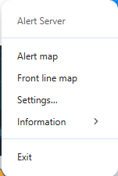
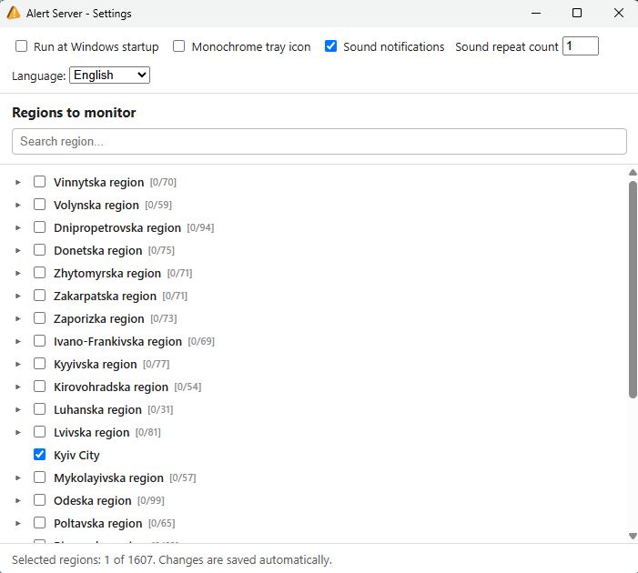
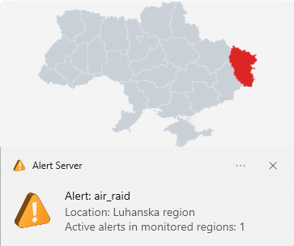

#  Alert Server

**[EN](https://github.com/sergeiown/Alert_Server/blob/main/README.md)** | [UA](https://github.com/sergeiown/Alert_Server/blob/main/README-UA.md)

> **Disclaimer. The aggressor state's full-scale war against Ukraine has been ongoing since February 2014 and escalated into a full invasion on February 24, 2022. The entire territory of Ukraine remains a zone of active hostilities and potential missile threat. Stay vigilant, never ignore air raid alerts, and follow safety guidelines.**

A Windows tray application built with Electron that receives alert data from [alerts.in.ua](https://alerts.in.ua/) at a specified frequency and displays it through the Windows Notification Center for the regions of Ukraine you choose to monitor.

## Architecture

## Installation

Download the latest installer (`Alert Server Setup x.x.x.exe`) from [Releases](https://github.com/sergeiown/Alert_Server/releases) and run it. It's a standard NSIS installer: no administrator rights required, per-user install, with a Start Menu shortcut and uninstaller created automatically.

Future updates are detected and installed automatically from GitHub Releases; you'll only need to run the installer manually once.

## Usage

On first launch the app appears as a tray icon only, no window. Everything is controlled from the tray icon's context menu:

- **Alert map** / **Front line map** open [alerts.in.ua](https://alerts.in.ua/) and [DeepState](https://deepstatemap.live) in a dedicated app window.
- **Forecast** opens a window showing, for each monitored region, either a notice that an alert is currently active or historical statistics from the past month (alert count, average interval, most common time and day of week, time since the last alert ended) plus, for each alert type, a probability and an ETA. Both numbers now come from one underlying statistical model, so they no longer contradict each other: recent alerts count more than older ones, and alert types with little history get a cautious estimate instead of an overconfident one - still clearly labeled as statistics, not a guaranteed prediction. Each region's summary can be copied to the clipboard. Below the list, a small block shows how much alert history has accumulated locally beyond the API's 30-day window (used to make the rare-type estimates more stable), with a button to clear it if needed. The nearest upcoming forecast across your monitored regions is also visible at a glance, without opening this window - see below.
- **Settings…** opens a two-column settings window: regions to monitor on the left (searchable tree, from oblast down to individual community), and everything else on the right - interface language, monochrome tray icon, visual notifications (with a separate toggle just for active-alert notifications), forecast-approach notifications and how many minutes ahead to warn, sound notification mode (none, siren, or voice) and its repeat count, and launching at Windows startup. Dependent options grey out automatically (e.g. the sound repeat count when sound is off). Follows the Windows light/dark theme automatically.
- **Information → Log** opens an in-app, terminal-styled log viewer with a clear-log button; **About** shows the current version, license, and a link to the project's GitHub page.

Notifications for the start and end of an alert appear through the Windows Notification Center; clicking one shows the alert's location and start time.

Left-clicking the tray icon opens a small popup with any active alerts and, below them, the nearest upcoming forecast for your monitored regions - handy when you just want a quick glance without opening the Forecast window. Hovering the tray icon shows the same nearest forecast as a tooltip when there's no active alert. If enabled in Settings (on by default), the app also sends a quiet notification - no sound - when a forecasted alert time is approaching, separate from the loud alert/cancellation notifications above.

The event log records app activity (start/exit, settings and region changes, alerts, update checks) and is capped at 256 KB, automatically trimmed once it grows past that.

## Removal

Use the `Alert Server` entry in Windows Settings → Apps, or the uninstaller shortcut created alongside the Start Menu shortcut.

## Contribution

If you have suggestions or want to propose improvements to the project, please open a pull request.

## License

[Copyright (c) 2024-2026 Serhii I. Myshko](https://github.com/sergeiown/Alert_Server/blob/main/LICENSE) - MIT License
