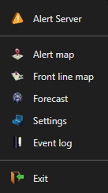
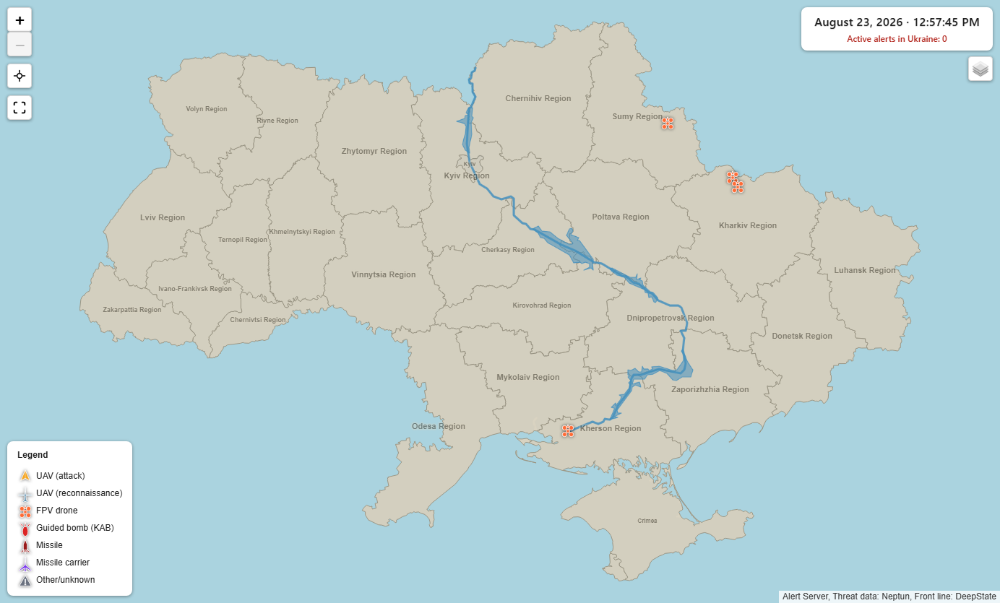
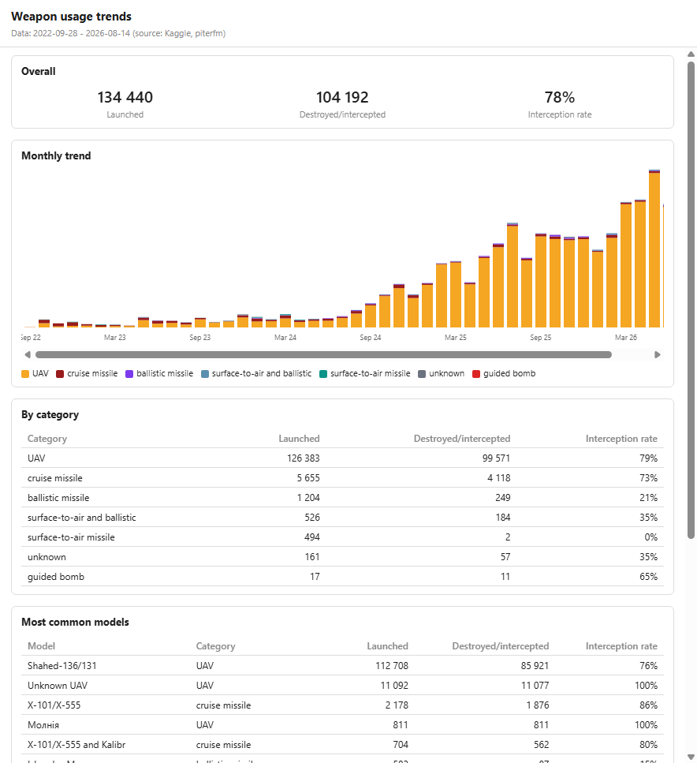
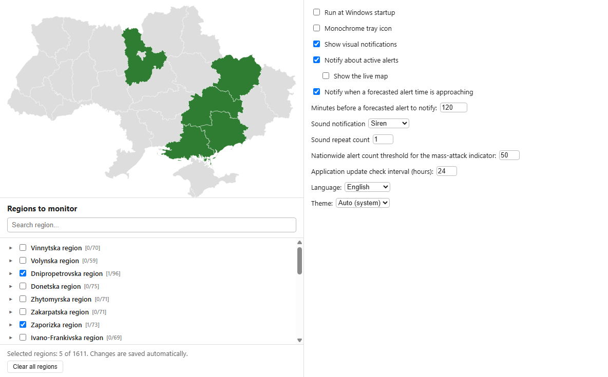
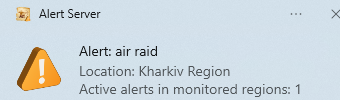
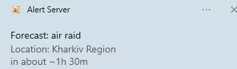

#  Alert Server

> **Disclaimer. The aggressor state's full-scale war against Ukraine has been ongoing since February 2014 and escalated into a full invasion on February 24, 2022. The entire territory of Ukraine remains a zone of active hostilities and potential missile threat. Stay vigilant, never ignore air raid alerts, and follow safety guidelines.**

A Windows tray application built with Electron that receives alert data from [alerts.in.ua](https://alerts.in.ua/) at a specified frequency, shows it through the Windows Notification Center for the regions of Ukraine you choose to monitor, and brings together a live threat map, a statistics-based forecast, and nationwide weapon-usage trends in one place.

## Architecture

## Installation

Download the latest installer (`Alert Server Setup x.x.x.exe`) from [Releases](https://github.com/sergeiown/Alert_Server/releases) and run it. It's a standard NSIS installer: no administrator rights required, per-user install, with a Start Menu shortcut and uninstaller created automatically.

Future updates are detected and installed automatically from GitHub Releases; you'll only need to run the installer manually once. The app checks shortly after every launch and then keeps re-checking periodically (interval configurable in Settings, a day by default) for as long as it keeps running, so a tray app left open for weeks still gets updates without ever needing a manual restart. A small window shows download progress, and once downloaded the app restarts itself to finish installing - no reboot needed.

## Usage

On first launch the app appears as a tray icon only, no window. The icon itself (color or monochrome, per Settings) automatically matches the Windows light/dark taskbar theme and its actual size at the current display scaling. It shows an exclamation mark and rocks side to side with a red pulse for the whole duration of an active alert, briefly pulses on every refresh while there's no active alert, and turns fully red when the nationwide active-alert count crosses a threshold you set (a mass-attack indicator, independent of your own monitored regions). Everything is controlled from the tray icon's context menu:

- **Live map** opens the app's own map window: real-time threats from [Neptun](https://neptun.in.ua) (drones, missiles, guided bombs, missile-carrier aircraft - each with its own icon and, where known, a direction of travel), the front line from [DeepState](https://deepstatemap.live), occupied territories (hatched), and every oblast/raion/city currently under alert shaded in a red that deepens the longer the alert has been running. Layers toggle independently, the view is fullscreen-capable, and a status bar shows the current date/time and the nationwide active-alert count.

  

- **Forecast** opens a window showing, for each monitored region, either a notice that an alert is currently active or historical statistics from the past month (alert count, average interval, most common time and day of week, time since the last alert ended) plus, for each alert type, a probability and an ETA. See [forecast methodology](docs/forecast-methodology-en.md) for how this is calculated, what the numbers mean, and known limitations of the approach - still clearly labeled as statistics, not a guaranteed prediction. Cards are sorted by how soon an alert is expected, with active regions first; if a whole region and one of its districts are both tracked, only the region's (already-aggregated) card is shown. Each region's summary can be copied to the clipboard. Below the list, a small block shows how much alert history has accumulated locally beyond the API's 30-day window (capped at about 2 years, with a button to clear it if needed), plus a note on the historical dataset used to calibrate the model's long-horizon baseline.
- **Trends** opens a window with nationwide weapon-usage statistics compiled from a public dataset (see [Data sources & credits](#data-sources--credits)): totals and interception rate, a monthly chart broken down by weapon category, and tables by category and by specific model.

  

- **Settings** opens a two-column settings window: regions to monitor on the left (a clickable map of Ukraine's oblasts above a searchable tree going down to individual community - selecting a region on either one selects it on the other; checking a higher-level region selects everything nested inside it; a button clears the whole selection at once), and everything else on the right - interface language and light/dark/auto theme, monochrome tray icon, visual notifications (with separate toggles for active-alert notifications and forecast-approach notifications, plus how many minutes ahead to warn), the nationwide alert-count threshold for the mass-attack tray indicator, sound notification mode (none, siren, or voice) and its repeat count, how often the app checks for a new version, and launching at Windows startup. Dependent options grey out automatically (e.g. the sound repeat count when sound is off).

  

- **Event log** opens an in-app, terminal-styled log viewer with buttons to clear it or open the underlying file directly in Notepad.

Clicking the **Alert Server** entry at the top of the menu opens the About window, showing the current version, license, and a link to the project's GitHub page.

Notifications for an alert starting or ending appear through the Windows Notification Center with a small map showing the affected region (red for a new alert, green for a cancellation); clicking one shows the alert's location and start time. If more than 5 alerts start or clear at once, you get a single notification with the total count and all affected regions highlighted instead of a flood of individual ones.

Left-clicking the tray icon opens a small popup with any active alerts and, below them, the nearest upcoming forecast for your monitored regions - handy when you just want a quick glance without opening the Forecast window. Hovering the tray icon shows the same nearest forecast as a tooltip when there's no active alert. If enabled in Settings (on by default), the app also sends a notification - with a blue region map, no alert sound - when a forecasted alert time is approaching, separate from the alert/cancellation notifications above; at most 3 fire per check, soonest first, to avoid a flood if many regions qualify at once.

The event log records app activity (start/exit, settings and region changes, alerts, update checks) as CSV, and is capped at 256 KB, automatically trimmed once it grows past that.

## Data sources & credits

Beyond [alerts.in.ua](https://alerts.in.ua/) (the primary alert source):

- **[Neptun](https://neptun.in.ua)** - live threat tracking (drones, missiles) shown on the Live map, consumed directly, no attribution required by its terms but credited in-app and here as a courtesy.
- **[DeepState](https://deepstatemap.live/)** - the front line shown on the Live map, mirrored daily via [cyterat/deepstate-map-data](https://github.com/cyterat/deepstate-map-data) (GPL-3.0). Consumed as a live data feed at runtime, not bundled code.
- **[Natural Earth](https://www.naturalearthdata.com/)** (via the [nvkelso/natural-earth-vector](https://github.com/nvkelso/natural-earth-vector) mirror) - the Dnipro river outline on the Live map. Public domain, no attribution required.
- **[slawomirmatuszak/ukrainian_geodata](https://github.com/slawomirmatuszak/ukrainian_geodata)** - oblast, raion, and city/hromada boundaries used throughout the Live map. **Licensed [CC BY 4.0](https://creativecommons.org/licenses/by/4.0/) - attribution required**, given here.
- **[MapSVG](https://mapsvg.com/maps/ukraine)** - the base Ukraine outline used for the region-picker map and notification thumbnails. Free to use, including commercially, no attribution required by its own terms.
- **[Vadimkin/ukrainian-air-raid-sirens-dataset](https://github.com/Vadimkin/ukrainian-air-raid-sirens-dataset)** (MIT) - several years of real nationwide siren history, used once, offline, to calibrate the forecast model's long-horizon baseline (see [forecast methodology](docs/forecast-methodology-en.md)). Not bundled with the app, not fetched at runtime.
- **["Massive Missile Attacks on Ukraine"](https://www.kaggle.com/datasets/piterfm/massive-missile-attacks-on-ukraine) by Petro Ivaniuk (piterfm), via Kaggle** - the data behind the Trends window, refreshed automatically through the app's own proxy (the Kaggle credentials never leave that proxy). **Licensed [CC BY-NC-SA 4.0](https://creativecommons.org/licenses/by-nc-sa/4.0/)**: attribution required, **non-commercial use only**, and share-alike (the Trends window is effectively a derivative presentation of this data). This app is free and non-commercial, which satisfies the NC term, but it's a real constraint worth knowing about. Also worth noting: as of this writing, the dataset's own upstream source (Ukrainian Air Force public reporting) stopped publishing new figures on August 10, 2026, so the automatic refresh may not surface new data past that date until/unless that changes.
- **[Leaflet](https://leafletjs.com/)** (BSD-2-Clause) powers the Live map, together with a [fullscreen control](https://github.com/sergeiown/Leaflet_FullScreen_Button) - an earlier plugin project of mine for Leaflet that turned out to fit right in here.

## Removal

Use the `Alert Server` entry in Windows Settings → Apps, or the uninstaller shortcut created alongside the Start Menu shortcut.

## Contribution

If you have suggestions or want to propose improvements to the project, please open a pull request.

## License

[Copyright (c) 2024-2026 Serhii I. Myshko](https://github.com/sergeiown/Alert_Server/blob/main/LICENSE) - MIT License
